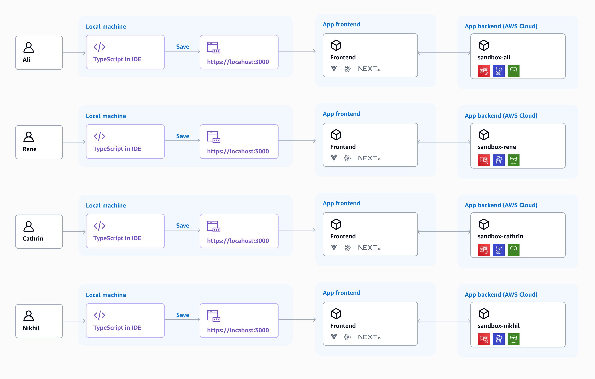

* goal
  * set up a cloud sandbox environment
    * == isolated development space /
      * per-developer
      * -- can connect to -- cloud resources 
    * uses
      * with your frontend dev environment
    * allows
      * rapidly | fullstack app
        * build,
        * test,
        * iterate

* Cloud sandbox environments
  * uses
    * NOT | production workloads



## Create a new sandbox environment

* TODO:
You can set up a new sandbox environment on your machine once you have an Amplify app set up. If you have not yet created an Amplify Gen 2 app, visit the [Quickstart](/[platform]/start/quickstart).

First, open the terminal and run the following command:

```bash title="Terminal" showLineNumbers={false}
npx ampx sandbox
```

When you deploy a cloud sandbox, Amplify creates an [AWS CloudFormation](https://aws.amazon.com/cloudformation/) stack following the naming convention of `amplify-<app-name>-<$(whoami)>-sandbox` in your AWS account with the resources configured in your `amplify/` folder.


After a successful deployment, `sandbox` watches for file changes in your `amplify/` folder and performs real-time updates to the associated CloudFormation stack. This functionality is built leveraging the [hot swap capability of the AWS Cloud Development Kit (CDK)](https://docs.aws.amazon.com/cdk/v2/guide/cli.html#cli-deploy-hotswap).


### Terminating a sandbox environment

After testing all the changes associated with the backend, you can terminate the sandbox session via <kbd>Ctrl</kbd>+<kbd>c</kbd> and can then choose whether you want to keep or delete all the resources in the sandbox environment.


## Manage sandbox environments

You can view and manage all the sandbox environments for your team in the new [Amplify console](https://us-east-1.console.aws.amazon.com/amplify/apps/sandboxes). This is useful for a team leader to audit all of the Amplify sandbox environments deployed within an account.

Choose **Manage Sandboxes** to get started:


You can then check the number, status, and last updates for sandbox environments across your team. You can also use the console to delete sandbox environments when no longer needed.


## Best practices

Keep the following best practices in mind when working with cloud sandbox environments:

- Sandboxes are identical in fidelity to your production environments.
- Code changes are continuously deployed to your sandbox on every save for fast iterations.
- Use sandboxes for experimentation and testing, not for production workloads.
- Deploy one sandbox per Amplify app per developer to prevent conflicts.
- Reset sandboxes occasionally to clear out unused resources and save costs.
