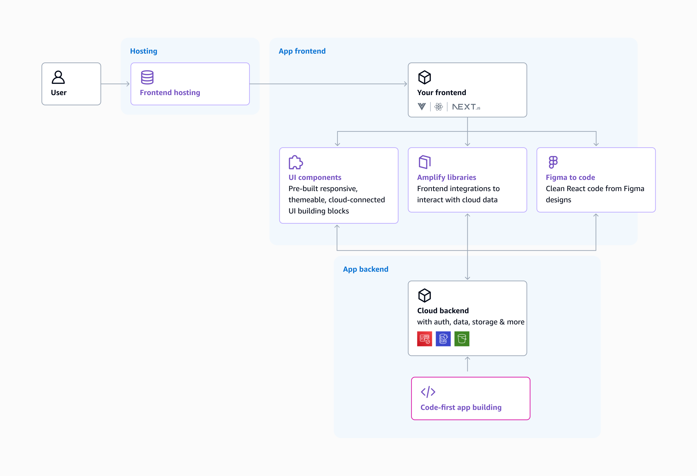
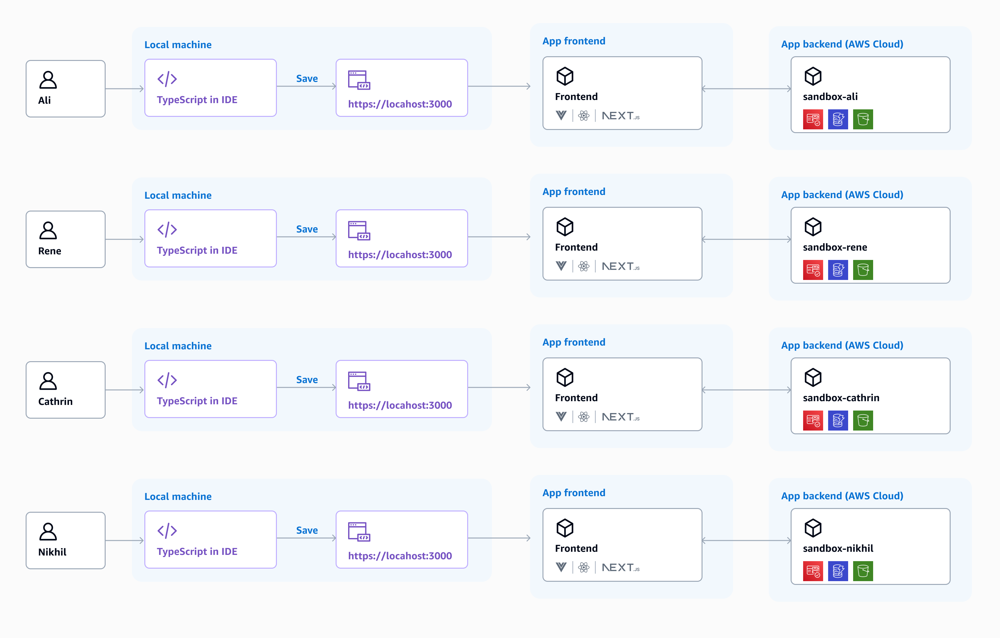

* AWS Amplify Gen 2
  * how to define backends?
    * TypeScript-based,
    * code-first developer experience (DX) /
      * unified Amplify developer experience == hosting + backend + UI-building capabilities
  * allows
    * 👀FE developers can deploy cloud infrastructure -- via -- expressing (| TypeScript) their app's data model, business logic, authentication, authorization rules👀
      * Reason: 🧠Amplify automatically configures the correct cloud resources🧠
  * layered
    * | [AWS CDK](https://docs.aws.amazon.com/cdk/api/v2/)
    * Data and Auth capabilities | `@aws-amplify/backend` / wrap L3 AWS CDK constructs
      * -> extend the resources / generated by Amplify -> does NOT require ANY special configuration

## Capabilities

* E2E fullstack development

### Build fullstack apps with TypeScript

* authoring TypeScript -> you can provision backend infrastructure


* how to provision infrastructure Gen2 vs Gen 1
  * box at the bottom (outlined in pink)
  * | Gen 1,
    * ways
      * Studio's console, or
      * CLI
  * | Gen 2,
    * author TypeScript code / follow a file-based convention
      * allows
        * gain strict typing / prevent errors
      * file-based convention -- follows the -- "convention over configuration" paradigm
        * == if you group resource definitions by type | separate files -> know exactly where to look for
      * _Example:_ `amplify/auth/resource.ts` or `amplify/auth/data.ts`

### Faster local development

* 👀isolated cloud sandbox development environment / EACH developer 👀
  * allows
    * faster iterations
  * uses
    * test their changes | deploying high-fidelity AWS backends
      * Gen 2 deployments <= 8x faster Gen 1 deployments
  * isolated
    * == EACH developer work on fullstack features / WITHOUT disrupting each other's environments



### Fullstack Git-based environments

* ALL shared environments (_Example:_ `production`, `staging`, `gamma`) -- are mapped 1:1 to -- Git branches | your repository
* NEW features can be tested | ephemeral environments
  * BEFORE merging | production
  * ways to merge to production
    * PR previews
    * feature branches
* CLI or Console, to set up a fullstack environment
  * Gen 1 requires configuration
  * Gen 2 is zero-config
* 💡our code-first approach💡
  * -> Git repository == source of truth for state of the fullstack app
    * == ALL backend resources -- are defined as -- code


### Unified management console

* Amplify Gen 2 console
  * allows
    * managing ALL
      * branches
      * builds,
      * hosting settings (such as custom domains),
      * deployed resources (such as data browser or user management),
        * ALSO, you can access -- via -- dedicated AWS service consoles
      * environment variables
      * secrets

<Video src="/images/gen2/how-amplify-works/console.mp4" description="Video - Amplify Gen 2 Console" />

## Build an app

### Data

* `@aws-amplify/backend` library
  * == TypeScript-first `Data` library /
    * allows
      * setting up
        * FULLY typed real-time APIs (-- powered by -- AWS AppSync GraphQL APIs)
        * NoSQL databases (-- powered by -- Amazon DynamoDB tables)
* Once you generate an Amplify backend -> you will have an `amplify/data/resource.ts` /
  * contain your app's data schema
* `defineData` function
  * schema -- is turned into a -- FULLY functioning data backend / ALL the boilerplate handled automatically
* schema-based approach
  * 👀evolution of the Gen 1's Amplify GraphQL API 👀
  * allows
    * dot completion,
    * IntelliSense,
    * type validation
  * _Example:_ data model for a chat app

    ```ts
    const schema = a.schema({
      Chat: a.model({
        name: a.string(),
        message: a.hasMany('Message', 'chatId'),
      }),
      Message: a.model({
        text: a.string(),
        chat: a.belongsTo('Chat', 'chatId'),
        chatId: a.id()
      }),
    });
    ```

* automatic generation of your types / NO explicit codegen step
  * codegen step required | Gen 1
  * `generateClient` function
    * provides a typed client instance
    * making it easy to integrate CRUD operations for your models | your application code
    * _Example:_

      ```ts
      // generate your data client using the Schema from your backend
      const client = generateClient<Schema>();

      // list all messages
      const { data } = await client.models.Message.list();

      // create a new message
      const { errors, data: newMessage } = await client.models.Message.create({
        text: 'My message text'
      });
      ```

### Auth

* Auth works == data works
* `amplify/auth/resource.ts`
  * configure the authentication settings -- for -- your app
  * _Example:_ change the verification email's subject line

```ts title="amplify/auth/resource.ts"
export const auth = defineAuth({
  loginWith: {
    email: {
      verificationEmailSubject: 'Welcome 👋 Verify your email!'
    }
  }
});
```

* ways to customize your authentication flow
  * customized sign-in and registration flows,
  * MFA,
  * TP social providers
* if you add auth | your app -> Amplify deploys an Amazon Cognito instance | your AWS account
  * uses
    * if you want to add user flows -> use the Amplify
      * `Authenticator` component or
      * client libraries
    * _Example:_

      ```ts
      import { withAuthenticator } from '@aws-amplify/ui-react';

      function App({ signOut, user }) {
        return (
          <>
            <h1>Hello {user.username}</h1>
            <button onClick={signOut}>Sign out</button>
          </>
        );
      }

      export default withAuthenticator(App);
      ```

### UI building

* quickly build web app user interfaces -- via --
  * UI component library,
  * Figma-to-code generation,
  * CRUD form-generation capabilities
* see [here](https://ui.docs.amplify.aws/react/components)


## Connecting to AWS beyond Amplify

### Add any AWS resource

* _Example:_ adds Amazon Location Services -- via --
  * create it -- via -- AWS CDK

    ```ts
    import { CfnOutput, Stack, StackProps } from 'aws-cdk-lib';
    import * as locations from 'aws-cdk-lib/aws-location';
    import { Construct } from 'constructs';

    export class LocationMapStack extends Stack {
      constructor(scope: Construct, id: string, props?: StackProps) {
        super(scope, id, props);

        // Create the map resource
        const map = new locations.CfnMap(this, 'LocationMap', {
          configuration: {
            style: 'VectorEsriStreets' // map style
          },
          description: 'My Location Map',
          mapName: 'MyMap'
        });

        new CfnOutput(this, 'mapArn', {
          value: map.attrArn,
          exportName: 'mapArn'
        });
      }
    }
    ```

  * include | `amplify/custom/maps/resource.ts`
    * Reason: 🧠 -> included | `amplify/backend.ts` 🧠

      ```ts
      import { Backend } from '@aws-amplify/backend';
      import { auth } from './auth/resource';
      import { data } from './data/resource';
      import { LocationMapStack } from './locationMapStack/resource';

      const backend = new Backend({
        auth,
        data
      });

      new LocationMapStack(
        backend.getStack('LocationMapStack'),
        'myLocationResource',
        {}
      );
      ```

### Connect to existing resources

* _Example1:_ Amplify's pre-built authentication UI components / -- relies on -- existing Amazon Cognito user pool
* _Example2:_ display images & files | your app / -- from an -- existing Amazon S3 bucket
  * -> integrate with Amplify Storage

## Next steps

* see [quickstart tutorial](/[platform]/start/quickstart/)
